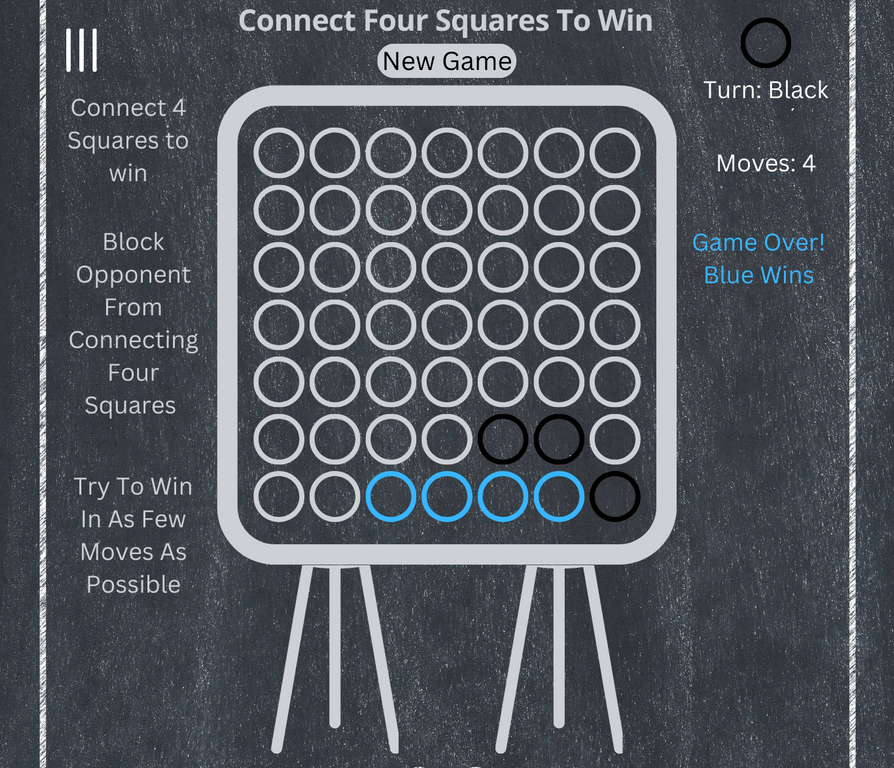

# Connect Four

# Live site at

> https://connect-four-lime.vercel.app/

---

---

## The Pitch

---

The perfect time for a board game can materialize out of nowhere. For my wife and I it is always when the power gets knocked out by winter storms. We have a few games that we play: Monopoly, Catan and a few other family favorites. But the real choice is always connect four.

It usually starts with her and I splitting the games 50/50 ish. But then something happens and she keeps outwitting me (or cheating)... However you look at it. She is winning more than her fair share.

Connect Four For Desktop is going to be the new rage. All the cool kids will be practicing and preparing for the next storm of the century.

And...

The beauty of connect four. It's simple. Get four in a row, while callously thwarting your opponents intrusions into your territory. Don't let them connect four! And while your at it, try to win in as few moves as possible.

## The Aesthetic

---

## MVP

---

> User Stories

> Create a browser based two player version of connect four that will show a win condition when a player connects four squares and disables the board.

> Switch between players and display turn and win conditions in the UI programmatically

> Implement a board reset that does not use location.reload()

> Use development best practices to create UI that is intuitive and accessible.

> Create menu button that when clicked will display game rules to the screen

> Create html with semantic markup

> Create game logic and implement it with vanilla JS with no alerts

> Deploy Game

## Stretch Goals

---

> set each aside to a different player and their stats. Have an indicator move from side to side to indicate whose turn it is.

> Alternate between players or have a cpu opponent

> Persistent win loss between users

> login and authentication

> Smart AI that doesn't just choose a random available square. Maybe by prioritizing finishing a win condition array if move is available.

> Players can choose colors and the background will change to create contrast if the color does not have enough contrast from the chosen color.

> Refactor to OOP

> Build CLI version of game

## Roadblocks

---

> The hardest part will be creating win conditions that do not require manually updating arrays with every win condition in a switch statement. There is probably a way to do it with math that would be a more programmatically elegant solution.

### Technical Requirements

---

> Display a game in the browser

> Switch turns between two players, or have the user play the computer (AI or obstacles)

> Design logic for winning & visually display which player won

> Include separate HTML / CSS / JavaScript files

> Stick with KISS (Keep It Simple Silly) and DRY (Don't Repeat Yourself) principles

> Use Javascript for DOM manipulation

> Deploy your game online, where the rest of the world can access it

> Inlcude in game instructions on how to play

> Not use any alerts

> Use semantic markup for HTML and CSS (adhere to best practices)

> Have a way to reset the game on game over that does not rely on a page refresh

### Necessary Deliverables

---

> A working game, built by you, hosted somewhere on the internet

https://vercel.com/jaywomack/connect-four

> A git repository hosted on Github, with a link to your hosted game, and frequent commits dating back to the very beginning of the project

https://github.com/Jaywomack/connect_four

> A readme.md file with explanations of the following:

> a description of the app

The app is a connect four board game. It is a two player version of the popular connect four board game.

Players can drop a unique colored piece into the top of the board and it will drop to the lowest open space.

The goal is to connect four squares in a row while preventing your opponent from connecting four squares.

The code allows for a two players to play and reset the board once a player has won.

> a link to the deployed live site

https://vercel.com/jaywomack/connect-four

> the approach taken

The approach that I took was two create the board elements in the html with button elements. I set them all to disabled with the exception of the bottom row.

I attached event listeners to all of the squares (buttons) and on a click i implemented logic that would switch between players on every click and fill the clicked numbers into respective arrays for each player. The win array i initially attempted to find from an external source so i would not have to write out every condition. The array i found had mistakes so i ended up filling out the win conditions on my own.

I enabled board by filling an array with all of the choices that had been made and removing the disabled attribute from the square above. Each square above had an id that was 7 less than the one below it. Most of the logic was based off setting a unique id on each square that could be used to implement logic on individual squares.

I implemented a reset function that set the board to its original state and allows players to play again without reloading the page.

> explanations of the technologies used

I used html, css, and JS. I used them to prove to myself that I could. I initially was going to build the project with React, but vanilla js is an important skill as well.

I also use grid to get some better understanding of the grid layout system. I use flex more often than not, so learning some of the nuances of grid was helpful to my overall knowledge of layout systems.

I used git for version control and committed and pushed often to allow myself to have constant save points that I could roll back to if i needed to. I implemented a reset function that was overly complicated and was able to roll back to a previous commit where i was able to easily implement my reset function. Github is useful as many deployment options allow you to connect your repo and easily deploy your app. I used github's project management for a Kanban board as well.

I deployed to vercel. I chose vercel for the ease of use and my familiarity with their platform.

> wireframes

> a post-project reflection with any unsolved problems or growth areas you may have had

Reflecting back on the project I see why OOP is so popular. Being able to abstract away code and hide all of the implementation details is useful. Something i want to learn and implement in future projects would be to use OOP at a professional level that would create a repo another developer could follow behind and easily get up to speed with the codebase and be able to adapt the code and implement new features.

> any sources used
> The code is my own.

### Tech Stack

---

> HTML

> CSS

> JS

> GIT

> GITHUB (Repo & Kanban Board)

> Vercel (hosting)
